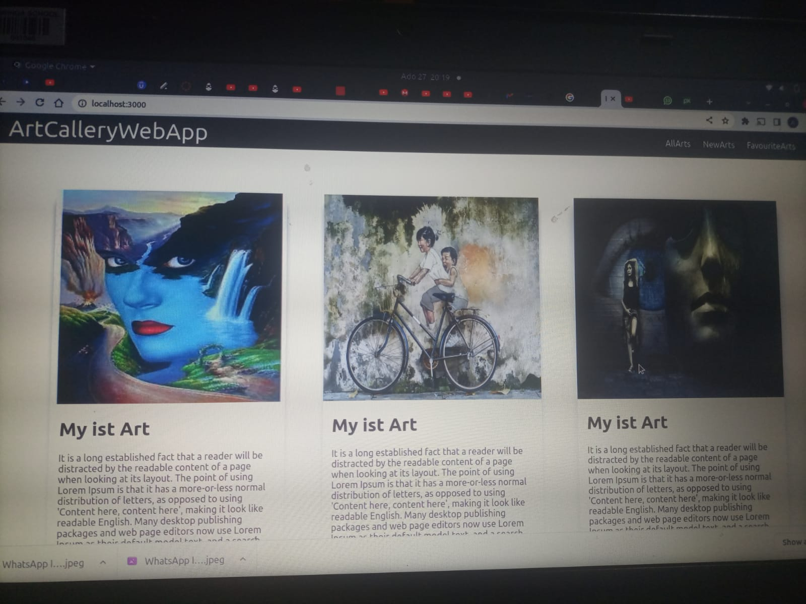
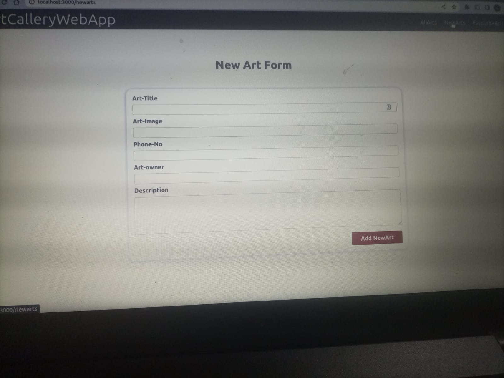

# ArtGalleryWebApp

## By Alex kimathi murithi

## screenshot

## Table Of Content

-[Description](#description)
-[Features](#features)
-[Requirement](#requirement)
-[Live Link](#live link)
-[Technology Used](#technology-used)
-[License](#license)

## Description 

This project is a webapp to allow the creatives post their Art-Work and share with people for selling purposes 

[Go Back to the top](# ArtGalleryWebApp)

## Features

As a user of the website, You will be able to:

1. See artwork listing
2. list your Art work
3. Choose your Favorite Arts

[Go Back to the top](# ArtGalleryWebApp)

### Requirements
* Access to a computer or any Smart Gadget
* Access to internet

### instalation process 

***
* clone their repo: https://github.com/Alexkimathi/ArtWorkWebApp
* unzip the downloaded files in a folder of choice.
* open the index.html file from the unzipped file with any browser

***

[Go Back to the top](# ArtGalleryWebApp)

### Live Link

-click this link to view the live application https://merry-blancmange-86705e.netlify.app

### Technology Used

* jsx - which was used to develope the structure off the pages.
* CSS - which was used to style the User Interface.
* Reactjs - for the interactivity of the site

## Licence
MIT License
Copyright (c) [2022] [Alex KImathi]
Permission is hereby granted, free of charge, to any person obtaining a copy
of this software and associated documentation files (the "Software"), to deal
in the Software without restriction, including without limitation the rights
to use, copy, modify, merge, publish, distribute, sublicense, and/or sell
copies of the Software, and to permit persons to whom the Software is
furnished to do so, subject to the following conditions:
The above copyright notice and this permission notice shall be included in all
copies or substantial portions of the Software.
THE SOFTWARE IS PROVIDED "AS IS", WITHOUT WARRANTY OF ANY KIND, EXPRESS OR
IMPLIED, INCLUDING BUT NOT LIMITED TO THE WARRANTIES OF MERCHANTABILITY,
FITNESS FOR A PARTICULAR PURPOSE AND NONINFRINGEMENT. IN NO EVENT SHALL THE
AUTHORS OR COPYRIGHT HOLDERS BE LIABLE FOR ANY CLAIM, DAMAGES OR OTHER
LIABILITY, WHETHER IN AN ACTION OF CONTRACT, TORT OR OTHERWISE, ARISING FROM,
OUT OF OR IN CONNECTION WITH THE SOFTWARE OR THE USE OR OTHER DEALINGS IN THE
SOFTWARE.
[Go Back to the top](# ArtGalleryWebApp)

